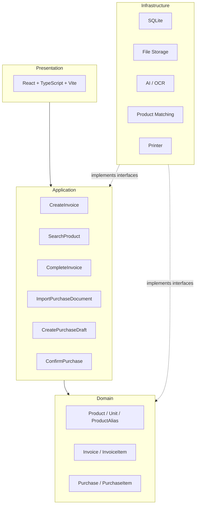

# Smart Invoice - Architecture Context

## 1. Architecture Goal

Smart Invoice is a desktop application running on a PC, with an architecture that prioritizes:

- PC-first
- Offline-first in the MVP
- Lightweight
- Modular
- SOLID / OOP
- Replaceable technology components without affecting Business Logic.

The architecture supports the MVP sales-invoice capability first and keeps a
replaceable boundary for the post-MVP AI purchase-document import capability:

1. Fast Sales Invoice
2. AI-assisted Purchase Document Import

**Scope note:** The application does NOT manage stock quantity
(inventory tracking). The sole purpose of Purchase is to support AI
import for detecting and adding new products to the catalog — it does not
track inbound/outbound quantities.

---

## 2. Architectural Style

Apply a modular layered architecture (a complete 4-layer architecture from the start):

```text
Presentation
      ↓
Application
      ↓
Domain
Infrastructure implements interfaces for the inner layers
```

Runtime calls flow from Presentation through Application and Domain. Dependency
direction points inward: Infrastructure implements interfaces defined for the
Application/Domain boundary and is not imported directly by Domain.

### Presentation Layer

Responsibilities: UI, User interaction, Keyboard-first workflow, Invoice
screen, Product search UI, Purchase/import review UI.

Technology: React, TypeScript, Vite

---

### Application Layer

Contains application use cases and orchestration.

```text
CreateInvoice
AddInvoiceItem
SearchProduct
CompleteInvoice

ImportPurchaseDocument
CreatePurchaseDraft
ConfirmPurchase   -> post-MVP; creates new Products after human confirmation
```

The Application layer orchestrates Domain objects through interfaces and does not
contain UI logic.

---

### Domain Layer

Contains business rules and domain entities.

```text
Product
Unit
ProductAlias
Invoice
InvoiceItem
Purchase
PurchaseItem
```

**Note:** There is no `InventoryMovement` — the application does not track
stock quantity. `Purchase`/`PurchaseItem` are only used to record new
products detected through AI import, not to increase/decrease quantities.

Important business rule:

```text
Product/Unit catalog price ≠ InvoiceItem.unit_price
```

The price in InvoiceItem must preserve the actual price at the time of the transaction,
even when the catalog price changes later.
AI must not directly commit a business transaction.

---

### Infrastructure Layer

```text
SQLite (@tauri-apps/plugin-sql)
File Storage
AI / OCR Provider (post-MVP)
Product Matching
Fuse.js
Printer (tauri-plugin-printer-v2)
```

Infrastructure must be accessed through an abstraction/interface where
appropriate.

---

## 3. Desktop Technology — Tauri v2

```text
React + TypeScript
        ↓
     Tauri v2
        ↓
       Rust
```

Reason: supports Windows/macOS/Linux, allows web technology for the UI,
provides native capabilities through Rust, and is lighter than frameworks
based on bundled Chromium. Tauri is not the business layer.

---

## 4. Frontend — React + TypeScript + Vite

```text
UI
 ↓
Application Use Case
 ↓
Repository / Service
 ↓
Infrastructure
```

The frontend must not access the database directly in an ad hoc manner.

---

## 5. Local Database - SQLite

Chosen for the MVP because of the single-PC, local-first, offline operation,
small/medium dataset, and no need for a database server.

```text
Product, Unit, Invoice, InvoiceItem
```

`Purchase` and `PurchaseItem` remain post-MVP concepts for AI-assisted product
discovery. They are not part of the initial four-table migration.

---

## 6. Database Access

```text
React
 ↓
Use Case
 ↓
Repository
 ↓
SQLite
```

React Components must not call Raw SQL directly.

---

## 7. Product Search

Barcode is not used in the MVP.

```text
User Input
    │
    ├── Exact search: optional SKU / ID
    │
    └── Name / brand / category / alias search → Fuse.js
```

Expected scale: hundreds → several thousand products (up to ~10K). If the catalog
grows significantly, the search implementation can be replaced without changing
the domain logic.

---

## 8. Product Alias

Supporting mechanism for search and AI matching.

```text
Product: Coca Cola 330ml
Aliases: Coca 330, CC330, Coca can
```

```text
User Search / AI Extraction → Alias/Name Matching → Product
```

An official or internal product code belongs in `Product.sku`. A code or name
used only by one purchase-document issuer belongs in a source-scoped
`ProductAlias`; it must not become a global SKU.

The ProductAlias contract is defined in §19. Its persistence is deferred from
the initial migration to a later numbered migration before `INV-005` product
search or AI import is implemented.

---

## 9. AI / Document Processing

AI is an infrastructure capability, not a domain core.

```text
Purchase Document
       ↓
Document Extraction (header / table / footer)
       ↓
Normalization
       ↓
Product Matching (each line independently)
    ↓
Purchase Draft (only for adding new Products; does not increase quantities)
       ↓
Human Review
       ↓
Confirm
```

AI is only allowed to Extract, Normalize, Suggest, and Match. AI does not directly:
Commit Invoice, Commit Purchase, or Create Product without confirmation.

The document issuer is matching context, not Product identity. The extractor
must distinguish issuer data in the header from printer/designer branding in
the footer. A source fingerprint is derived from tax code, then phone number,
then normalized issuer name. This source metadata does not create a `Supplier`
entity or supplier-management capability.

---

## 10. AI Abstraction

```text
DocumentExtractor
        │
        ├── AI Provider A
        ├── AI Provider B
        └── Local / Future Provider

ProductMatcher
        │
        ├── Exact SKU matching
        ├── Source-scoped and global alias matching
        ├── Name + brand + specification + unit matching
        ├── Fuse.js candidate generation
        └── AI-assisted matching
```

Do not lock business logic to a specific AI vendor.

Each extracted line produces one review state:

```text
matched       -> preselect an existing Product; human confirmation required
ambiguous     -> show candidate Products; human selection required
new_candidate -> propose a Product; human creation and selling price required
```

Low confidence alone does not prove a Product is new because OCR may be wrong.
Confirmed mappings are stored as aliases and reused on later imports. Different
document sources may map different aliases to the same Product. Match precision
is favored over automatic coverage because a false existing-product match is
more harmful than an extra review step.

---

## 11. OCR / AI Vendor Decision

No vendor has been committed. Candidates include Veryfi, Azure AI Document Intelligence,
and other Vision/OCR providers; a vendor will be selected only after benchmarking
against real-world data (Vietnamese, handwriting, low-quality images, each
supplier's specific format, and line-item extraction).

The architecture commits only to the `DocumentExtractor Interface`, not to
a specific vendor.

---

## 12. Printer Architecture

```text
Application
    ↓
PrinterService Interface
    ↓
Printer Adapter
    ↓
OS / Printer Plugin / ESC-POS
```

The `tauri-plugin-printer-v2` adapter is the approved printer integration.
A technical spike with real hardware is still needed to determine whether the
MVP should target a standard/PDF printer or a 58mm/80mm thermal printer.

---

## 13. File Storage

```text
SmartInvoice/
├── database.db      (SQLite - structured data)
├── documents/        (original purchase-invoice images/PDFs)
├── exports/
└── backups/
```

TXT/JSON/CSV are used only for Export/Import/Backup and are not primary
storage for business transactions.

---

## 14. Core Architecture Diagram



---

## 15. Technology Decisions

| Layer / Concern | Decision | Status |
|---|---|---|
| Desktop | Tauri v2 | ✅ |
| Frontend | React | ✅ |
| Language | TypeScript | ✅ |
| Build tool | Vite | ✅ |
| Local DB | SQLite | ✅ |
| Search | Fuse.js | ✅ MVP |
| Barcode | Not required | ✅ |
| Product Alias | Supported | ✅ |
| Inventory quantity tracking | **Not required (explicitly excluded)** | ✅ |
| OCR Provider | Vendor-neutral | ⚠ |
| Printer Plugin | `tauri-plugin-printer-v2` via `PrinterService` | ✅ |
| Cloud Backend | Not required for MVP | ✅ |
| PostgreSQL | Future scaling option | 🔮 |
| Architecture depth | Full 4-layer from the start | ✅ |

---

## 16. Key Architectural Principles

1. **Business Logic Independence** — Domain logic does not directly depend
    on React, Tauri, SQLite, an AI Vendor, or a Printer Vendor.
2. **Replaceable Infrastructure** — SQLite, the AI Provider, the Printer
    implementation, and the Search implementation can all be replaced without
    rewriting the core business logic.
3. **Human-in-the-loop for AI** — AI proposes → User reviews → System
   commits.
4. **AI Failure Isolation** — If AI is unavailable, only AI Import is
    affected; Sales Invoice, Product Management, and Invoice History continue
    to operate normally.
5. **Transaction Integrity** — Complete Invoice (Create Invoice + Create
    InvoiceItems) must be atomic; the database must not be left in a partial state.

---

## 17. Current Architecture Boundary

Focus: Desktop Application → Sales → Product → Purchase (only for adding
new Products through AI) → AI Document Processing.

**Not** required in the MVP: Cloud Backend, Multi-branch, ERP, Accounting
System, CRM, E-commerce, Payment Gateway, Advanced Analytics, AI
Forecasting, Barcode Hardware, **Inventory/Stock Quantity Tracking**.

---

## 18. Architecture Decision Status

**Confirmed:** PC-first, Tauri v2, React + TypeScript, Vite, SQLite,
Full 4-layer Architecture, SOLID-oriented design, Fuse.js, No barcode
dependency, Human-in-the-loop AI, Local-first MVP, No inventory
quantity tracking, UUID domain identifiers, integer VND money, positive-integer
invoice quantities, transaction-time InvoiceItem snapshots, optional Product
SKU/brand, and source-scoped ProductAlias matching.

**Pending Technical Spike:** Printer hardware/output format, AI/OCR provider,
AI confidence thresholds, and learned-reranker/fine-tuning viability after a
labeled benchmark dataset exists.

**Future Evolution:** SQLite → PostgreSQL; Local App → Backend API →
Multi-PC/Multi-branch.

---

## 19. MVP Domain and Persistence Contract

This section is the field-level source of truth for the initial schema and the
Domain/Application contracts. SQLite table and column names use `snake_case`;
Domain and Application code use the TypeScript naming rules in
`CODING_CONVENTIONS.md`.

### 19.1 Shared Representations

#### Identifiers

- `Product`, `Unit`, `Invoice`, and `InvoiceItem` use UUID v4 strings.
- SQLite stores UUIDs as `TEXT PRIMARY KEY NOT NULL`.
- Application code generates IDs with the native `crypto.randomUUID()` API;
  Domain entities do not import browser, Tauri, or SQLite APIs.
- IDs are immutable and never reused.

#### Money

- The MVP currency is VND and is not repeated on each row.
- All monetary values are non-negative integer VND amounts.
- The valid persisted range is `0..9,007,199,254,740,991`
  (`Number.MAX_SAFE_INTEGER`). Each price, subtotal, and total must remain in
  that range.
- SQLite uses `INTEGER`; TypeScript uses `number` guarded by
  `Number.isSafeInteger` and the documented range validations.
- `REAL`, floating-point persisted money, and implicit currency conversion are
  forbidden.
- Because quantity is an integer, `subtotal = unit_price * quantity` is exact
  and requires no fractional rounding.

#### Quantity

- `InvoiceItem.quantity` is a positive integer in the range
  `1..9,007,199,254,740,991` (`Number.MAX_SAFE_INTEGER`).
- Fractional quantities are deferred until a real use case defines precision
  and rounding behavior.
- Invoice quantity represents an amount sold only. It does not represent stock
  on hand and never triggers inventory deduction.

#### Timestamps

- SQLite stores timestamps as ISO-8601 UTC `TEXT` values.
- `created_at` is immutable; `updated_at` changes on every persisted mutation.
- Application/Infrastructure boundaries exchange timestamps in their canonical
  ISO-8601 UTC representation.

### 19.2 Initial Schema Scope

The `0001_*` migration contains exactly these four tables:

```text
products
units
invoices
invoice_items
```

`product_aliases`, `purchases`, and `purchase_items` are not part of the initial
migration. Any later persistence addition uses a new numbered migration.

### 19.3 Products

| Column | SQLite contract | Domain rule |
|---|---|---|
| `id` | `TEXT PRIMARY KEY NOT NULL` | UUID v4; immutable |
| `sku` | nullable `TEXT` | trimmed; non-empty when present; unique case-insensitively |
| `name` | `TEXT NOT NULL` | trimmed and non-empty; duplicates allowed |
| `brand` | nullable `TEXT` | trimmed and non-empty when present |
| `category` | nullable `TEXT` | trimmed and non-empty when present |
| `is_active` | `INTEGER NOT NULL DEFAULT 1` | boolean encoded as `0`/`1` |
| `created_at` | `TEXT NOT NULL` | immutable UTC timestamp |
| `updated_at` | `TEXT NOT NULL` | UTC timestamp updated on mutation |

Application code supplies `id`, `name`, and timestamps. Optional `sku`,
`brand`, and `category` default to `NULL`; `is_active` defaults to `1`.

Required constraints and indexes:

- `CHECK (length(trim(name)) > 0)` and equivalent nullable-field checks that
  reject blank `sku`, `brand`, or `category` values when present.
- `CHECK (is_active IN (0, 1))`.
- A partial unique, case-insensitive index on non-null `sku`.
- Non-unique indexes supporting `is_active`, `name`, `brand`, and `category`
  lookups.
- There is no unique constraint on `name`; duplicate Product names are an
  explicit requirement.
- Normal Product removal updates `is_active` to `0`; it never executes a hard
  delete.

### 19.4 Units

| Column | SQLite contract | Domain rule |
|---|---|---|
| `id` | `TEXT PRIMARY KEY NOT NULL` | UUID v4; immutable |
| `product_id` | `TEXT NOT NULL` | references its owning Product |
| `name` | `TEXT NOT NULL` | trimmed and non-empty |
| `price` | `INTEGER NOT NULL` | non-negative integer VND |
| `is_active` | `INTEGER NOT NULL DEFAULT 1` | boolean encoded as `0`/`1` |
| `created_at` | `TEXT NOT NULL` | immutable UTC timestamp |
| `updated_at` | `TEXT NOT NULL` | UTC timestamp updated on mutation |

Application code supplies `id`, `product_id`, `name`, `price`, and timestamps;
`is_active` defaults to `1`.

Required constraints and indexes:

- `FOREIGN KEY (product_id) REFERENCES products(id) ON DELETE RESTRICT`.
- `CHECK (length(trim(name)) > 0)`.
- `CHECK (price BETWEEN 0 AND 9007199254740991)` and
  `CHECK (is_active IN (0, 1))`.
- Unit names are unique case-insensitively within a Product.
- An index on `(product_id, is_active)` supports loading owned active Units.
- Every Product must have at least one active Unit. Domain/Application logic
  enforces this cross-row invariant, and repository writes persist the Product
  plus all owned Unit changes in one transaction.
- Removing a Unit is soft deactivation through `is_active`; historical Unit
  references are never hard-deleted.

### 19.5 Invoices

| Column | SQLite contract | Domain rule |
|---|---|---|
| `id` | `TEXT PRIMARY KEY NOT NULL` | UUID v4; immutable |
| `invoice_number` | `INTEGER NOT NULL UNIQUE` | positive, user-facing identity |
| `status` | `TEXT NOT NULL DEFAULT 'draft'` | `draft` or `completed` only |
| `total` | `INTEGER NOT NULL DEFAULT 0` | non-negative integer VND |
| `created_at` | `TEXT NOT NULL` | immutable UTC timestamp |
| `updated_at` | `TEXT NOT NULL` | UTC timestamp updated on mutation |
| `completed_at` | nullable `TEXT` | null for draft; set on first completion |

Application code supplies `id`, `invoice_number`, and timestamps. `status`
defaults to `draft`, `total` defaults to `0`, and `completed_at` defaults to
`NULL`.

Required constraints and indexes:

- `CHECK (invoice_number BETWEEN 1 AND 9007199254740991)`.
- `CHECK (status IN ('draft', 'completed'))`.
- `CHECK (total BETWEEN 0 AND 9007199254740991)`.
- A status/timestamp consistency check requires `completed_at IS NULL` while
  status is `draft` and `completed_at IS NOT NULL` while status is `completed`.
- Indexes support status and `created_at` history queries.
- The next invoice number is selected and inserted in the same SQLite write
  transaction. Gaps are allowed.

State rules:

- A new Invoice starts as `draft` and may initially contain no items so it can
  be auto-saved immediately.
- Draft items, quantities, transaction prices, and totals may change.
- `draft -> completed` requires at least one valid item.
- A completed Invoice does not transition back to `draft`.
- Editing a completed Invoice requires explicit Presentation confirmation. The
  confirmed write replaces its items and total atomically while preserving
  `id`, `invoice_number`, `created_at`, and the original `completed_at`;
  `status` remains `completed` and `updated_at` changes.
- There is no audit/version table.

### 19.6 Invoice Items

| Column | SQLite contract | Domain rule |
|---|---|---|
| `id` | `TEXT PRIMARY KEY NOT NULL` | UUID v4; immutable |
| `invoice_id` | `TEXT NOT NULL` | owning Invoice reference |
| `product_id` | `TEXT NOT NULL` | catalog reference retained for traceability |
| `unit_id` | `TEXT NOT NULL` | catalog reference retained for traceability |
| `product_name` | `TEXT NOT NULL` | transaction-time snapshot |
| `product_sku` | nullable `TEXT` | transaction-time snapshot |
| `product_brand` | nullable `TEXT` | transaction-time snapshot |
| `unit_name` | `TEXT NOT NULL` | transaction-time snapshot |
| `unit_price` | `INTEGER NOT NULL` | actual transaction price, including VIP override |
| `quantity` | `INTEGER NOT NULL` | positive integer |
| `subtotal` | `INTEGER NOT NULL` | `unit_price * quantity` |
| `created_at` | `TEXT NOT NULL` | immutable UTC timestamp |

Application code supplies every InvoiceItem field after Domain validation;
InvoiceItem columns have no database defaults, including nullable snapshot
fields, which are supplied explicitly as `NULL` when absent.

Required constraints and indexes:

- `FOREIGN KEY (invoice_id) REFERENCES invoices(id) ON DELETE CASCADE`.
- Product and Unit foreign keys use `ON DELETE RESTRICT`.
- Snapshot names are trimmed and non-empty. Nullable SKU/brand snapshots are
  trimmed and non-empty when present.
- `CHECK (unit_price BETWEEN 0 AND 9007199254740991)`,
  `CHECK (quantity BETWEEN 1 AND 9007199254740991)`,
  `CHECK (subtotal BETWEEN 0 AND 9007199254740991)`, and
  `CHECK (subtotal = unit_price * quantity)`.
- Indexes support lookup by `invoice_id`, `product_id`, and `unit_id`.
- Invoice history renders snapshot fields and never reads mutable catalog
  names, brands, SKUs, Unit names, or prices for historical display.

### 19.7 Transaction Boundaries

Each operation below is all-or-nothing:

1. Create or update a Product together with all owned Unit changes.
2. Soft-deactivate a Product and enforce its catalog visibility behavior.
3. Create an Invoice draft and assign its invoice number.
4. Apply one semantic draft edit and persist items plus the recalculated total.
5. Complete an Invoice by validating items and writing status, total, and
   `completed_at`.
6. Confirmed overwrite of a completed Invoice, including replacement items and
   recalculated total.

Database errors must retain operation context and roll back the entire
transaction. Infrastructure errors are mapped to Application-facing errors;
raw SQLite rows and SQL errors never leak into Domain or Presentation.

SQLite foreign-key enforcement must be enabled for every connection.

### 19.8 ProductAlias Contract and Persistence Timing

`ProductAlias` belongs to a Product and supports both user search and future AI
matching. Its contract is:

| Field | Future SQLite contract | Domain rule |
|---|---|---|
| `id` | `TEXT PRIMARY KEY NOT NULL` | UUID v4; immutable |
| `product_id` | `TEXT NOT NULL` | required Product reference |
| `alias` | `TEXT NOT NULL` | trimmed, non-empty raw alias or source item code |
| `normalized_alias` | `TEXT NOT NULL` | non-empty normalized matching value |
| `source_key` | nullable `TEXT` | document-source fingerprint when scoped |
| `source_name_raw` | nullable `TEXT` | issuer text retained for review/debugging |
| `unit_name` | nullable `TEXT` | source Unit context |
| `created_at` | `TEXT NOT NULL` | immutable ISO-8601 UTC timestamp |

Application code supplies required values. Nullable source fields default to
`NULL`. The future foreign key from `product_id` to `products.id` restricts
physical Product deletion. Exact alias uniqueness and lookup indexes are
intentionally decided in the later ProductAlias migration, based on the
normalization implementation delivered with `INV-005`.

The initial migration intentionally defers this table. Before `INV-005`, a new
numbered migration must define its exact SQLite constraints and indexes without
editing the initial migration.

For post-MVP AI import:

- Document extraction separates header, line-item table, and footer.
- `source_key` uses tax code first, then phone number, then normalized issuer
  name. It is matching metadata, not a `Supplier` entity.
- Each extracted line is matched independently using exact SKU, source-scoped
  alias, global alias, normalized name/brand/specification/Unit, and finally
  Fuse.js candidates.
- Brand, size, or specification conflicts reject or strongly penalize a match.
- Lines resolve to `matched`, `ambiguous`, or `new_candidate`.
- Existing matches reference existing Products. Only user-confirmed
  `new_candidate` lines may invoke `CreateProduct`, after at least one Unit and
  a selling price are supplied.
- Purchase-document prices never automatically become catalog selling prices.
- Confirmed mappings add or reinforce aliases. Model fine-tuning remains
  deferred until a labeled benchmark dataset demonstrates a need.
