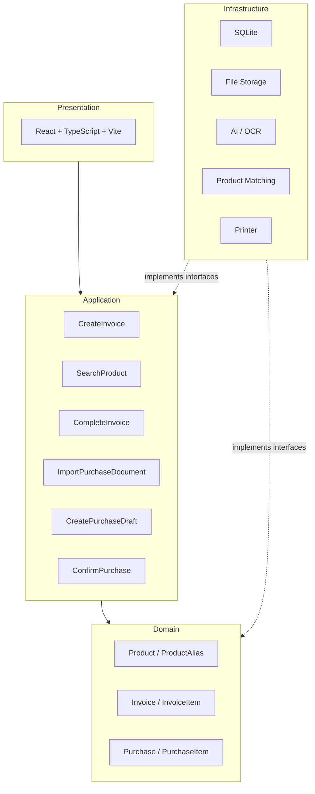

# Smart Invoice - Architecture Context

## 1. Architecture Goal

Smart Invoice is a desktop application running on a PC, with an architecture that prioritizes:

- PC-first
- Offline-first in the MVP
- Lightweight
- Modular
- SOLID / OOP
- Replaceable technology components without affecting Business Logic.

The architecture supports the MVP sales-invoice capability first and keeps a
replaceable boundary for the post-MVP AI purchase-document import capability:

1. Fast Sales Invoice
2. AI-assisted Purchase Document Import

**Scope note:** The application does NOT manage stock quantity
(inventory tracking). The sole purpose of Purchase is to support AI
import for detecting and adding new products to the catalog — it does not
track inbound/outbound quantities.

---

## 2. Architectural Style

Apply a modular layered architecture (a complete 4-layer architecture from the start):

```text
Presentation
      ↓
Application
      ↓
Domain
Infrastructure implements interfaces for the inner layers
```

Runtime calls flow from Presentation through Application and Domain. Dependency
direction points inward: Infrastructure implements interfaces defined for the
Application/Domain boundary and is not imported directly by Domain.

### Presentation Layer

Responsibilities: UI, User interaction, Keyboard-first workflow, Invoice
screen, Product search UI, Purchase/import review UI.

Technology: React, TypeScript, Vite

---

### Application Layer

Contains application use cases and orchestration.

```text
CreateInvoice
AddInvoiceItem
SearchProduct
CompleteInvoice

ImportPurchaseDocument
CreatePurchaseDraft
ConfirmPurchase   -> post-MVP; creates new Products after human confirmation
```

The Application layer orchestrates Domain objects through interfaces and does not
contain UI logic.

---

### Domain Layer

Contains business rules and domain entities.

```text
Product
ProductAlias
Invoice
InvoiceItem
Purchase
PurchaseItem
```

**Note:** There is no `InventoryMovement` — the application does not track
stock quantity. `Purchase`/`PurchaseItem` are only used to record new
products detected through AI import, not to increase/decrease quantities.

Important business rule:

```text
Product/Unit catalog price ≠ InvoiceItem.unit_price
```

The price in InvoiceItem must preserve the actual price at the time of the transaction,
even when the catalog price changes later.
AI must not directly commit a business transaction.

---

### Infrastructure Layer

```text
SQLite (@tauri-apps/plugin-sql)
File Storage
AI / OCR Provider (post-MVP)
Product Matching
Fuse.js
Printer (tauri-plugin-printer-v2)
```

Infrastructure must be accessed through an abstraction/interface where
appropriate.

---

## 3. Desktop Technology — Tauri v2

```text
React + TypeScript
        ↓
     Tauri v2
        ↓
       Rust
```

Reason: supports Windows/macOS/Linux, allows web technology for the UI,
provides native capabilities through Rust, and is lighter than frameworks
based on bundled Chromium. Tauri is not the business layer.

---

## 4. Frontend — React + TypeScript + Vite

```text
UI
 ↓
Application Use Case
 ↓
Repository / Service
 ↓
Infrastructure
```

The frontend must not access the database directly in an ad hoc manner.

---

## 5. Local Database - SQLite

Chosen for the MVP because of the single-PC, local-first, offline operation,
small/medium dataset, and no need for a database server.

```text
Product, Invoice, InvoiceItem, Purchase, PurchaseItem
```

---

## 6. Database Access

```text
React
 ↓
Use Case
 ↓
Repository
 ↓
SQLite
```

React Components must not call Raw SQL directly.

---

## 7. Product Search

Barcode is not used in the MVP.

```text
User Input
    │
    ├── Exact search: SKU / ID
    │
    └── Fuzzy search → Fuse.js
```

Expected scale: hundreds → several thousand products (up to ~10K). If the catalog
grows significantly, the search implementation can be replaced without changing
the domain logic.

---

## 8. Product Alias

Supporting mechanism for search and AI matching.

```text
Product: Coca Cola 330ml
Aliases: Coca 330, CC330, Coca can
```

```text
User Search / AI Extraction → Alias/Name Matching → Product
```

---

## 9. AI / Document Processing

AI is an infrastructure capability, not a domain core.

```text
Purchase Document
       ↓
Document Extraction
       ↓
Normalization
       ↓
Product Matching
    ↓
Purchase Draft (only for adding new Products; does not increase quantities)
       ↓
Human Review
       ↓
Confirm
```

AI is only allowed to Extract, Normalize, Suggest, and Match. AI does not directly:
Commit Invoice, Commit Purchase, or Create Product without confirmation.

---

## 10. AI Abstraction

```text
DocumentExtractor
        │
        ├── AI Provider A
        ├── AI Provider B
        └── Local / Future Provider

ProductMatcher
        │
        ├── Name matching
        ├── Alias matching
        ├── Fuzzy matching
        └── AI-assisted matching
```

Do not lock business logic to a specific AI vendor.

---

## 11. OCR / AI Vendor Decision

No vendor has been committed. Candidates include Veryfi, Azure AI Document Intelligence,
and other Vision/OCR providers; a vendor will be selected only after benchmarking
against real-world data (Vietnamese, handwriting, low-quality images, each
supplier's specific format, and line-item extraction).

The architecture commits only to the `DocumentExtractor Interface`, not to
a specific vendor.

---

## 12. Printer Architecture

```text
Application
    ↓
PrinterService Interface
    ↓
Printer Adapter
    ↓
OS / Printer Plugin / ESC-POS
```

The `tauri-plugin-printer-v2` adapter is the approved printer integration.
A technical spike with real hardware is still needed to determine whether the
MVP should target a standard/PDF printer or a 58mm/80mm thermal printer.

---

## 13. File Storage

```text
SmartInvoice/
├── database.db      (SQLite - structured data)
├── documents/        (original purchase-invoice images/PDFs)
├── exports/
└── backups/
```

TXT/JSON/CSV are used only for Export/Import/Backup and are not primary
storage for business transactions.

---

## 14. Core Architecture Diagram



---

## 15. Technology Decisions

| Layer / Concern | Decision | Status |
|---|---|---|
| Desktop | Tauri v2 | ✅ |
| Frontend | React | ✅ |
| Language | TypeScript | ✅ |
| Build tool | Vite | ✅ |
| Local DB | SQLite | ✅ |
| Search | Fuse.js | ✅ MVP |
| Barcode | Not required | ✅ |
| Product Alias | Supported | ✅ |
| Inventory quantity tracking | **Not required (explicitly excluded)** | ✅ |
| OCR Provider | Vendor-neutral | ⚠ |
| Printer Plugin | `tauri-plugin-printer-v2` via `PrinterService` | ✅ |
| Cloud Backend | Not required for MVP | ✅ |
| PostgreSQL | Future scaling option | 🔮 |
| Architecture depth | Full 4-layer from the start | ✅ |

---

## 16. Key Architectural Principles

1. **Business Logic Independence** — Domain logic does not directly depend
    on React, Tauri, SQLite, an AI Vendor, or a Printer Vendor.
2. **Replaceable Infrastructure** — SQLite, the AI Provider, the Printer
    implementation, and the Search implementation can all be replaced without
    rewriting the core business logic.
3. **Human-in-the-loop for AI** — AI proposes → User reviews → System
   commits.
4. **AI Failure Isolation** — If AI is unavailable, only AI Import is
    affected; Sales Invoice, Product Management, and Invoice History continue
    to operate normally.
5. **Transaction Integrity** — Complete Invoice (Create Invoice + Create
    InvoiceItems) must be atomic; the database must not be left in a partial state.

---

## 17. Current Architecture Boundary

Focus: Desktop Application → Sales → Product → Purchase (only for adding
new Products through AI) → AI Document Processing.

**Not** required in the MVP: Cloud Backend, Multi-branch, ERP, Accounting
System, CRM, E-commerce, Payment Gateway, Advanced Analytics, AI
Forecasting, Barcode Hardware, **Inventory/Stock Quantity Tracking**.

---

## 18. Architecture Decision Status

**Confirmed:** PC-first, Tauri v2, React + TypeScript, Vite, SQLite,
Full 4-layer Architecture, SOLID-oriented design, Fuse.js, No barcode
dependency, Human-in-the-loop AI, Local-first MVP, No inventory
quantity tracking.

**Pending Technical Spike:** Printer hardware/output format, AI/OCR provider,
exact database access strategy, exact AI matching strategy.

**Future Evolution:** SQLite → PostgreSQL; Local App → Backend API →
Multi-PC/Multi-branch.