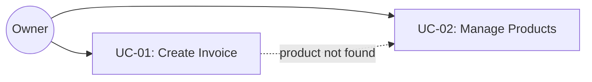
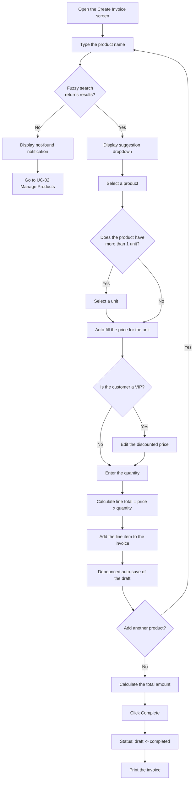

# Use Cases — Quick Invoice System

## Overview Diagram



---

## UC-01: Create Invoice

**Actor:** Owner
**Precondition:** The system has at least one active product in the database

### Main flow
1. Open the "Create Invoice" screen (new invoice, status = `draft`, with a
   positive user-facing invoice number assigned atomically)
2. Type the product name into the input field
3. The system performs a fuzzy search and displays a dropdown of matching products
4. Select a product (↑↓ + Enter, or click)
5. The system checks the number of units:
    - 1 unit → auto-fill the unit and price
    - >1 unit → select a unit → fill in the corresponding price
6. Enter a positive integer quantity → the system calculates the line total =
   price × quantity
7. Add the line item to the invoice table
8. The system automatically saves the draft to the database after each semantic change
9. Repeat steps 2–8 for other products
10. The system calculates the total amount
11. Click "Complete" → status changes from `draft` to `completed`
12. Click "Print" → send the invoice to the printer

### Alternate flow
- **A1 (VIP price):** Manually edit the price in steps 5/6 if the customer is a VIP
- **A2 (Edit a completed invoice):** Reopen a `completed` invoice → edit it → the system displays a confirmation dialog → if confirmed, the new data overwrites the old data

### Exception flow
- **E1:** No matching product is found → display a notification and suggest using UC-02 to add a new product
- **E2:** A line item is deleted by mistake → provide a delete-line button with undo support
- **E3:** The app closes unexpectedly → the draft data has already been saved automatically and will be restored when the app is reopened

### Approved invoice rules

#### Identity and values

- `Invoice.id` and every `InvoiceItem.id` are UUID v4 strings.
- `invoice_number` is a positive unique integer assigned when the draft is
  created. Number gaps are allowed.
- Money is stored as non-negative integer VND values; floating-point money is
  forbidden.
- Quantity is a positive integer. Fractional quantities and unit conversions
  are outside the MVP.
- A VIP price override changes the transaction-time `InvoiceItem.unit_price`;
  it never changes the selected Unit's catalog price.

#### Historical snapshots

When an item is added, it copies these catalog values into immutable
transaction-time fields:

```text
product_name
product_sku (nullable)
product_brand (nullable)
unit_name
unit_price
```

Invoice history and printing use these snapshots. They do not look up mutable
Product or Unit names/prices, so later catalog edits and deactivation cannot
change an old invoice.

#### Draft and completed state

- A draft may be empty and is persisted immediately so crash recovery works.
- A draft may change items, quantities, transaction prices, and total.
- Completing requires at least one valid item and changes `draft` to
  `completed`.
- A completed invoice never transitions back to `draft`.
- Reopening a completed invoice for editing requires explicit confirmation.
- A confirmed save atomically overwrites its items and total, preserves `id`,
  `invoice_number`, `created_at`, and the original `completed_at`, keeps status
  `completed`, and updates `updated_at`.
- There is no version or audit-history record.

#### Transaction boundaries

The following writes are atomic and roll back completely on failure:

1. Draft creation together with invoice-number assignment.
2. Each semantic draft edit together with item and total persistence.
3. Completion validation and the status/total/completion-time write.
4. Confirmed overwrite of a completed invoice and all replacement items.

Errors retain operation context for diagnostics and are mapped before reaching
the user; database rows or raw SQL errors do not leak into Presentation.

### Flow diagram



---
