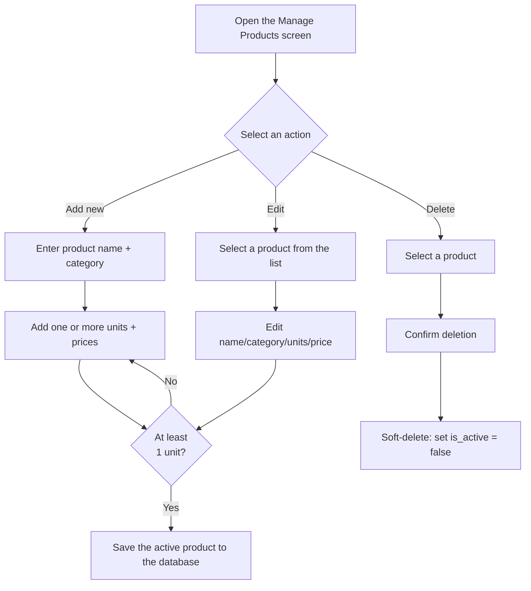
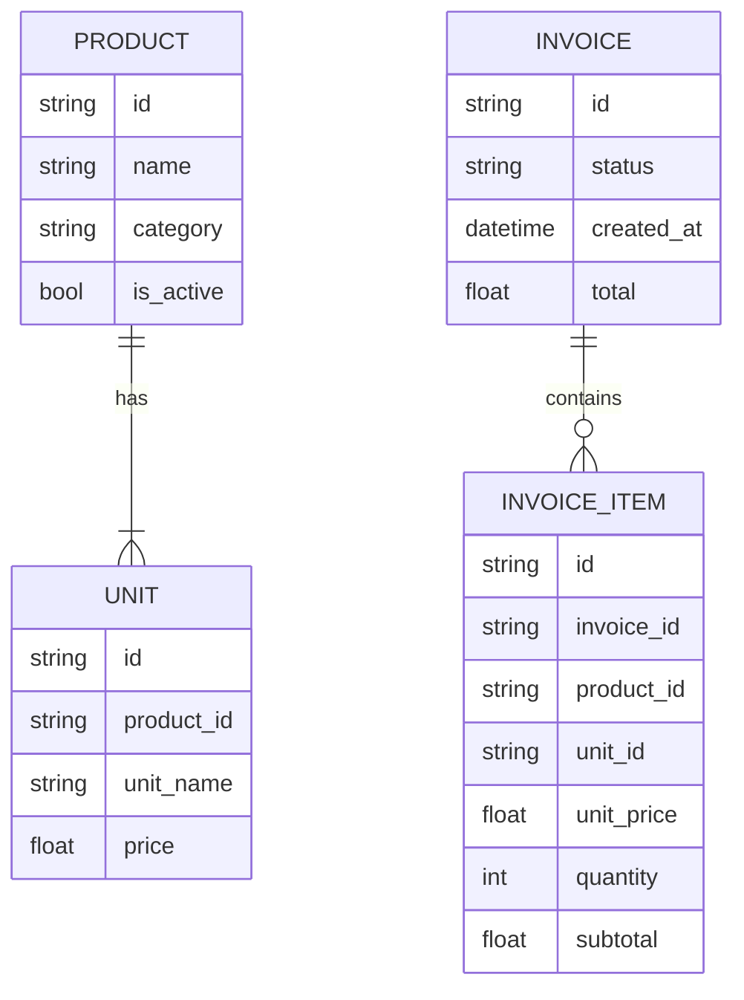

## UC-02: Manage Products

**Actor:** Owner
**Precondition:** None

### Main flow (Add a new product)
1. Open the "Manage Products" screen
2. Click "Add New Product"
3. Enter the product name + category (optional)
4. Add one or more units; each unit includes a unit name + price
5. The system validates that at least one unit is required before saving
6. Click "Save" → the active product and its units are added to the database

### Alternate flow
- **A1 (Edit a product):** Select a product from the list → edit its name/category/units/price → save
- **A2 (Add/delete a unit while editing):** Add or delete a unit directly in the edit screen, as long as at least one unit remains

### Exception flow
- **E1 (Delete a product used in an old invoice):** Use soft-delete by setting `is_active` to `false` instead of permanently deleting it from the database. Inactive products must not appear in autocomplete or be selectable for new invoices, while old invoices continue to display the correct name/price from the time of sale
- **E2 (Duplicate product names):** Allow duplicate names and distinguish them by category in the UC-01 dropdown

### Flow diagram

---

## Data Model (reference, derived from the two use cases above)

`Unit` is owned by `Product`; it is not a shared unit master and has no
conversion factor. Invoice items keep their transaction-time unit price.

