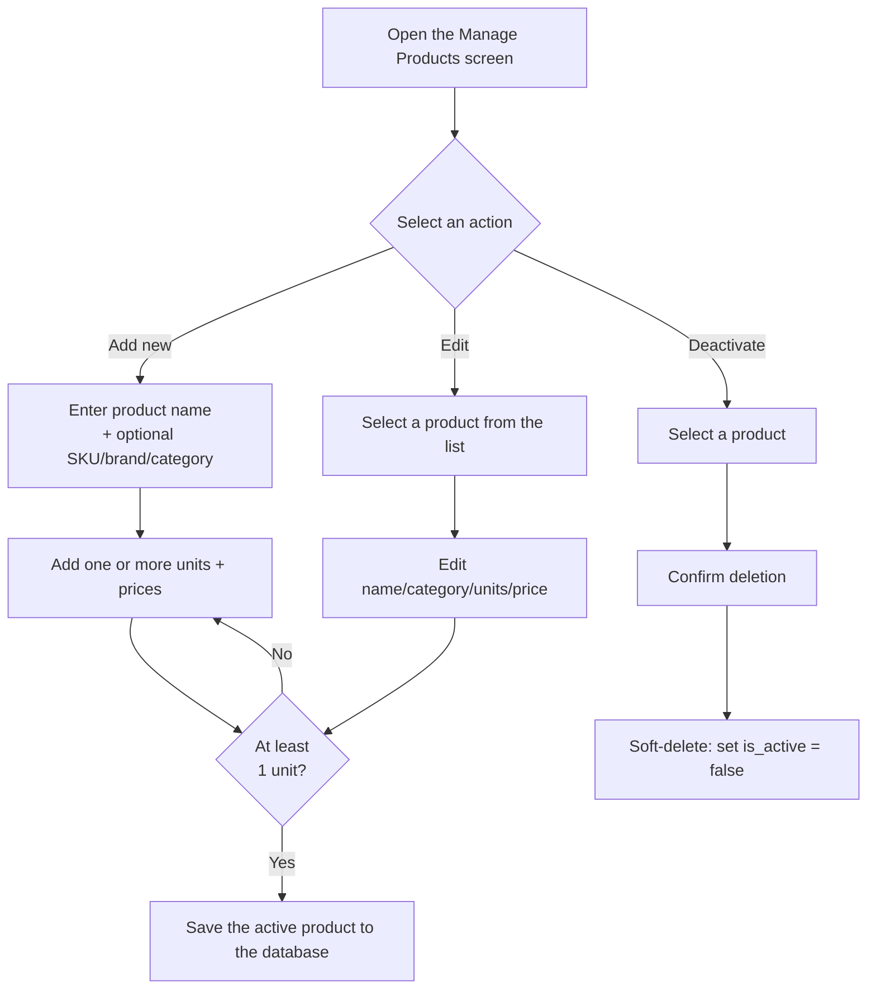
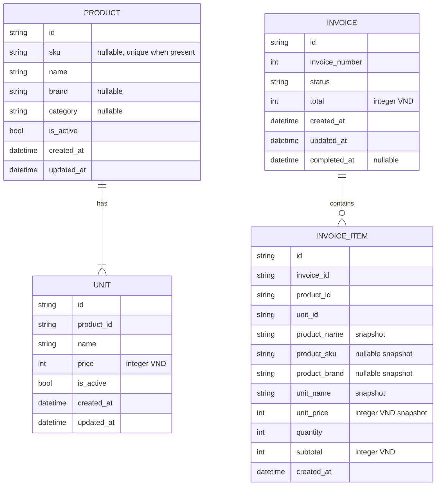

## UC-02: Manage Products

**Actor:** Owner
**Precondition:** None

### Main flow (Add a new product)
1. Open the "Manage Products" screen
2. Click "Add New Product"
3. Enter the product name, with optional SKU, brand, and category
4. Add one or more units; each unit includes a unit name + price
5. The system validates that at least one unit is required before saving
6. Click "Save" → the active product and its units are added to the database

### Alternate flow
- **A1 (Edit a product):** Select a product from the list → edit its name/SKU/brand/category/units/prices → save
- **A2 (Add/delete a unit while editing):** Add or remove a unit directly in the edit screen, as long as at least one active unit remains; removal soft-deactivates the Unit
- **A3 (Bulk import products from Excel/CSV):** Click "Import from Excel" → download template (optional) → select `.xlsx`/`.xls`/`.csv` file → preview and validate parsed rows (highlight errors, resolve SKU conflicts) → confirm import → atomic batch insert into SQLite → update product list and refresh Fuse.js search index

### Exception flow
- **E1 (Delete a product used in an old invoice):** Use soft-delete by setting `is_active` to `false` instead of permanently deleting it from the database. Inactive products must not appear in autocomplete or be selectable for new invoices, while old invoices continue to display the correct name/price from the time of sale
- **E2 (Duplicate product names):** Allow duplicate names and distinguish them by SKU, brand, and category in the UC-01 dropdown

### Approved Product and Unit rules

#### Product identity

- Product IDs are UUID v4 strings.
- `name` is required, trimmed, and non-empty, but it is not globally unique.
- `sku`, `brand`, and `category` are optional; when provided they are trimmed
  and non-empty.
- A non-null SKU is unique case-insensitively. An official/internal catalog
  code belongs in `Product.sku`; a code used only by one document source is a
  source-scoped ProductAlias instead.
- Products with the same name but different brand, specification, or SKU are
  separate catalog Products.
- The catalog uses optional SKU/brand/category together to disambiguate
  duplicate Product names.

#### Unit ownership and validation

- Unit IDs are UUID v4 strings.
- A Unit belongs directly to one Product and contains its own name and catalog
  price.
- Unit name is required, trimmed, non-empty, and unique case-insensitively
  within its Product.
- Catalog price is a non-negative integer VND value.
- There is no shared Unit master and no conversion factor.
- A Product must have at least one active Unit at creation and after every
  update.

#### Deactivation and atomicity

- Product removal sets `Product.is_active` to false; it never hard-deletes the
  Product.
- Unit removal sets `Unit.is_active` to false; it never hard-deletes a Unit
  referenced by history.
- Inactive Products are excluded from new-invoice search and selection, but
  remain queryable for administrative/history needs.
- Product and all owned Unit changes are written in one transaction. If any
  Unit validation or database write fails, no part of the Product update is
  persisted.
- Invoice history uses InvoiceItem snapshots rather than current Product or
  Unit values.

### Flow diagram

---

## Data Model (reference, derived from the two use cases above)

`Unit` is owned by `Product`; it is not a shared unit master and has no
conversion factor. Product and Unit catalog removal is soft deactivation.
Invoice items keep transaction-time identity and price snapshots.

